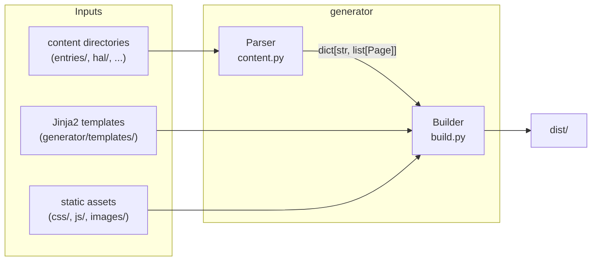
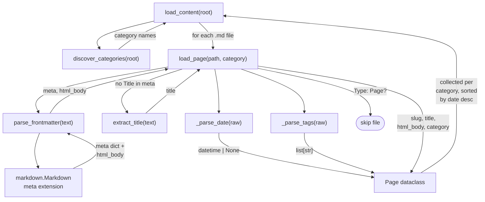
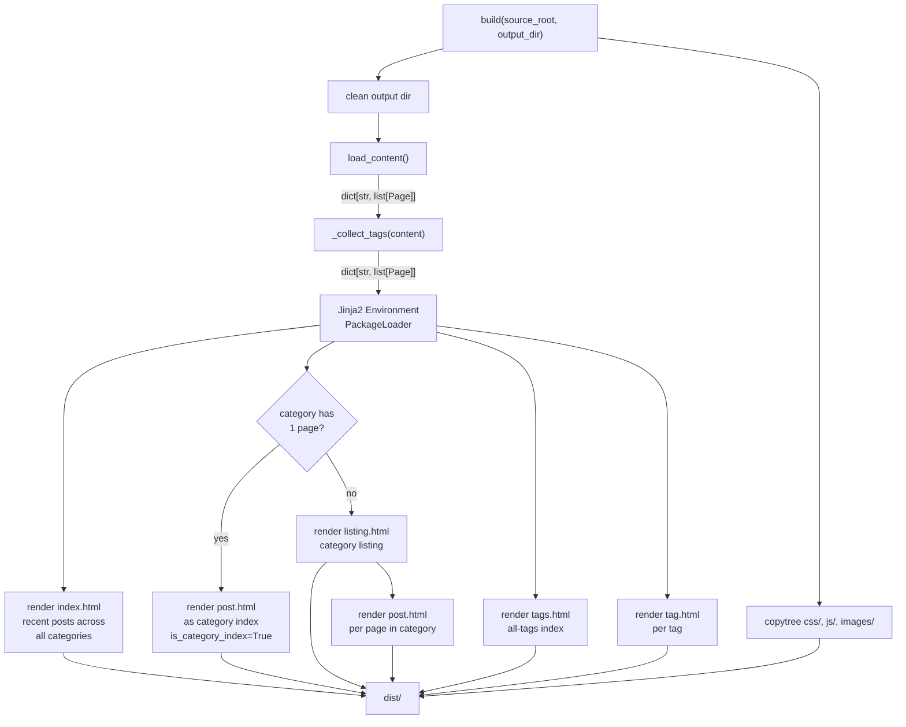

# xd1 generator

A provider-agnostic static site generator that converts Markdown content into
HTML. It auto-discovers content categories from the repository structure and
produces a complete site in `dist/`.

## Package layout

```
generator/
  __main__.py       CLI entry point
  content.py        Content discovery, parsing, and conversion
  build.py          Build orchestrator
  templates/
    base.html       Shared shell: head, nav, footer
    index.html      Landing page (recent entries across all categories)
    listing.html    Category listing (multiple pages in a category)
    post.html       Single page / post view
    tags.html       All-tags index
    tag.html        Single-tag page (posts with that tag)
```

## Architecture

The generator runs in two stages: **parse** then **build**.



### Parser (`content.py`)

The parser discovers content and converts it into `Page` objects.



**Category discovery.** `discover_categories()` scans the repo root for
directories that contain at least one `.md` file. Infrastructure directories
(`docs/`, `configuration/`, `css/`, `generator/`, etc.) are excluded via a
hardcoded set in `EXCLUDED_DIRS`. The remaining directories become site
categories, sorted alphabetically.

**Front-matter extraction.** `parse_frontmatter()` feeds each Markdown file
through Python-Markdown's `meta` extension, which strips the `---`-delimited
header and returns key-value metadata alongside the rendered HTML body. The
extension returns values as lists; the parser joins them back into plain
strings.

Recognized front-matter fields:

| Field  | Required | Description                                          |
|--------|----------|------------------------------------------------------|
| Date   | No       | `YYYY-MM-DD HH:MM` or `YYYY-MM-DD`. Used for sort.  |
| Tags   | No       | Comma-separated list. Used for tag pages.            |
| Title  | No       | Overrides the H1-derived title if present.           |
| Type   | No       | If set to `Page`, the file is skipped entirely.      |

**Title extraction.** When front-matter has no `Title` field,
`extract_title()` scans the raw Markdown for the first ATX heading (`# ...`)
and uses its text.

**Markdown conversion.** Python-Markdown runs with `meta`, `fenced_code`, and
`tables` extensions (configured inside `parse_frontmatter()`). The `fenced_code`
extension produces `<pre><code class="language-xxx">` blocks compatible with
Prism.js and Mermaid.

**Output.** `load_content()` returns a `dict[str, list[Page]]` mapping each
category name to its pages, sorted newest-first by date. Dateless pages sort
last.

### Builder (`build.py`)

The builder takes the parsed content, renders it through Jinja2 templates, and
writes the result to the output directory.



**Orchestration.** `build()` is the single entry point. It:

1. Cleans the output directory (full delete + recreate).
2. Calls `load_content()` to get all categories and pages.
3. Collects a global tag-to-pages index via `_collect_tags()`.
4. Sets up a Jinja2 environment with `PackageLoader` pointing at
   `generator/templates/`.
5. Renders pages in four passes (see below).
6. Copies static asset directories (`css/`, `js/`, `images/`) verbatim.

**Rendering passes:**

| Pass              | Template       | Output path                          |
|-------------------|----------------|--------------------------------------|
| Landing page      | `index.html`   | `dist/index.html`                    |
| Category pages    | `listing.html` | `dist/{category}/index.html`         |
| Individual pages  | `post.html`    | `dist/{category}/{slug}/index.html`  |
| Tag index         | `tags.html`    | `dist/tags/index.html`               |
| Per-tag pages     | `tag.html`     | `dist/tags/{tag}/index.html`         |

**Single-page categories.** When a category has exactly one `.md` file (e.g.,
`hal/about.md`), the builder skips the listing and renders that page directly
as the category index. The template receives `is_category_index=True` so it
can suppress the "back to listing" link.

**Shared template context.** Every template receives `categories` (the sorted
list of discovered category names), `site_title` (`"xd1"`), and `base_url`
(the normalised URL prefix passed via `--base-url` / `$BASE_URL`; defaults to
`"/"`). The navigation bar is built from `categories` in `base.html`, and all
internal hrefs are spliced with `base_url` so the site can be served either at
the document root or under a sub-path (e.g. GitHub project pages).

### Templates

All templates extend `base.html`, which defines three blocks:

| Block        | Purpose                                          |
|--------------|--------------------------------------------------|
| `title`      | HTML `<title>` content                           |
| `content`    | Main page body inside `<main>`                   |
| `head_extra` | Additional `<head>` elements (CSS, meta, etc.)   |

The current templates provide a minimal Dracula-tinted scaffold. They are
designed to be replaced wholesale by the theme port in work item
`blog-redesign-02`.

### Static assets

The directories `css/`, `js/`, and `images/` are copied to `dist/` unchanged.
Markdown files reference images with absolute paths like `/images/...`. The
`prefix_urls` Jinja filter (see `build.py`) rewrites those `src`/`href`
attributes in rendered post bodies to start with `base_url`, so absolute paths
work under any deployment prefix. Protocol-relative (`//cdn`) and fully
qualified (`https://`) URLs are left untouched.
