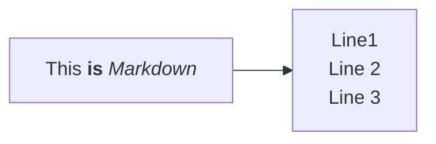
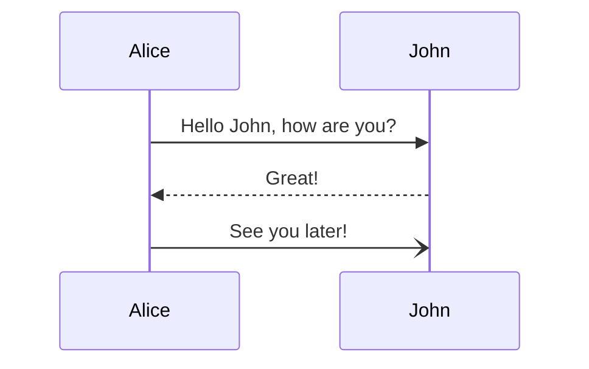
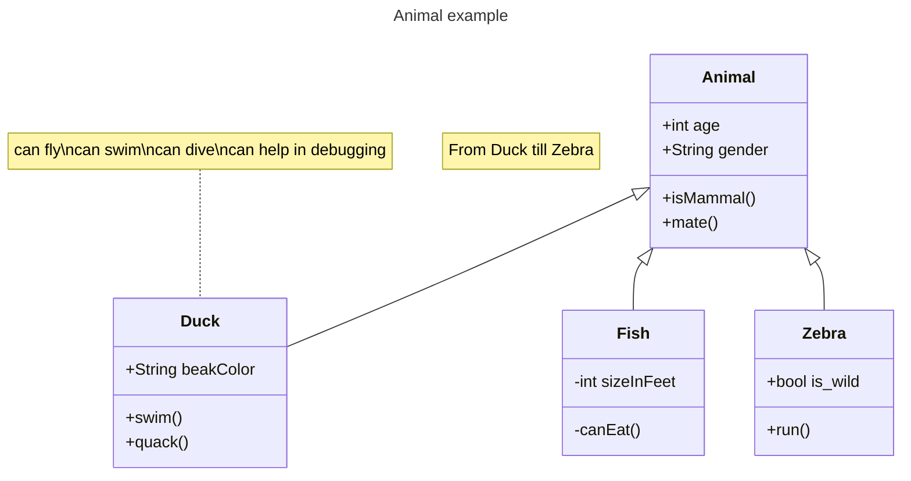

# Test post

This is a post to test features like code highlight and such.

## Code highlight testing

From <https://dev.to/renegadecoder94/fibonacci-in-every-language-1l46>.

```haskell
fib :: Integer -> Integer
fib 0 = 0
fib 1 = 1
fib n = fib (n-1) + fib (n-2)
```

```python
import math
from decimal import Decimal, getcontext

getcontext().prec = 1000
ONE = Decimal(1)
SQRT_FIVE = Decimal(5).sqrt()
HALF = Decimal(0.5)
PHI = (ONE + SQRT_FIVE) * HALF


def fibonacci(n):
    if n == 0:
        return 0
    return math.floor((PHI ** n) / SQRT_FIVE + HALF)
```

```go
package main

import (
    "fmt"
    "os"
    "strconv"
)

func fib(n int) {
    a, b := 0, 1
    for i := 0; i < n; i++ {
        a, b = b, a+b
        fmt.Printf("%d: %d\n", i+1, a)
    }
}

const msg = "Usage: please input the count of fibonacci numbers to output"

func main() {
    if len(os.Args) == 1 {
        fmt.Println(msg)
        return
    }
    if os.Args[1] == "" {
        fmt.Println(msg)
        return
    }
    n, err := strconv.Atoi(os.Args[1])
    if err != nil {
        fmt.Println(msg)
        return
    }
    fib(n)
}
```

```javascript
function fib(i){ 
    if (i<=0) return -1;
    else if (i==1) return 1;
    else if (i==2) return 1;
    else return fib(i-1)+fib(i-2)
}

// some examples
//fib(3) returns 2
//fib(5) returns 5
```

## Bash double bracket fix

Currently, weblog has issues rendering `[[` inside code blocks. The issue is described here: <https://discourse.lol/t/page-link-markdown-rendering-inside-code-block/780/2>.

```bash
# ...
if ! [[ -f "$DB_FILE" ]]; then
# ...
fi
```

## Mermaid

Mermaid graphs should be rendered instead of highlighting the mermaid code itself







## Easier images from github

This feature should rewrite image tags when syncrhonizing articles to weblog. I should only have to write relative paths to github, but when sending to weblog
they should be rewritten with the full URL, thus working on both platforms without me having to commit the full URL.


